# Explanova — AI Product Case Study

> A parent's AI avatar that teaches K–12+ S.T.E.M. homework on a virtual whiteboard, grounded in a curated 10,476-entry knowledge corpus and a production GraphRAG retrieval layer.

**🚀 Live demo:** **[explanova.ai](https://explanova.ai)**


**AI:**


**GCP:**


**Data:**


**Frontend + business:**


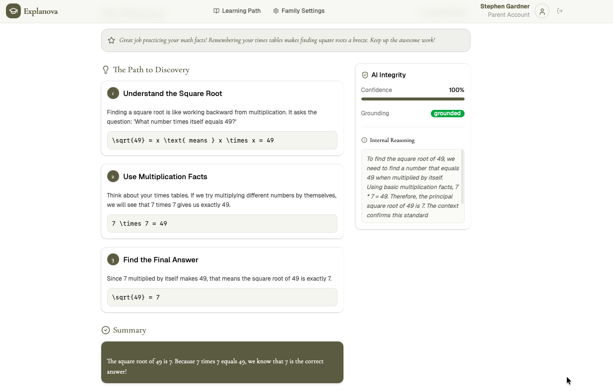

---

## TL;DR for hiring managers

| | |
|---|---|
| **What it is** | A generative-AI tutoring SaaS where a parent's cloned avatar (face + voice + likeness) explains the child's homework, step-by-step, on an animated whiteboard. |
| **Why it matters** | Closes the $60–100/hr private-tutor gap for working families — built by a Navy veteran and parent in the DMV who lived the problem. |
| **Status** | Live in production at [explanova.ai](https://explanova.ai). 16 semver releases (v1.0.0 → v3.5.4). 78/78 automated UX validation tests passing across desktop + mobile viewports. |
| **My role** | Sole founder, product owner, and technical lead — ideation through production deployment. |
| **Stack signals** | **Gemini 3 Pro Preview** (32K thinking budget) primary · **Gemini 3 Flash Preview** ingestion · **Gemini 2.5 Flash** GraphRAG summaries · **Claude Sonnet** failover · **Vertex AI** (`text-embedding-004` + Generative Models) · **Google Cloud TTS** (Neural2-F, ADC-authenticated, rate-limited) · **Google ADK** (Agent Development Kit — built a custom dev-support agent for the build process) · **GraphRAG** (Neo4j + community detection) · **Agentic AI orchestration** (plan → verify → execute with supervised LLM agents) · **Firebase** (Hosting · Functions · Firestore · Auth · App Check + reCAPTCHA v3) · **Cloud Run · Cloud Build · Cloud Secret Manager** · React + TypeScript + Tailwind · Playwright UX validation · FFmpeg + HeyGen + Seedance for avatar composition. |

This repository is the **public case study** behind the product. It walks through the methodology, decisions, and skill domains exercised — without exposing proprietary code.

---

## The journey at a glance

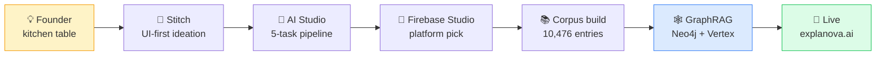

## The story arc — ideation → production

### 1. Founder origin

I'm Stephen D. Gardner — a Navy veteran (2002–2008, Active Duty) and a parent in the DMV. The thing that started this product was sitting at the kitchen table watching my own kids struggle with homework that I could not always explain in real time. Private tutoring runs $60–100/hr. That price tag shouldn't decide who falls behind.

So I built the tutor I wished we had: the **parent** explaining the homework, just as a synthesized version of themselves on screen, grounded in actual K–12 curriculum sources rather than free-form generation.


### 2. UI-first ideation in Google Stitch

Before any code, I prototyped the entire surface area in **Google Stitch** to pressure-test whether a parent-avatar tutor *could* feel warm, simple, and trustworthy enough for a kitchen-table moment. Nine screens covering the full journey — landing, dashboard, avatar onboarding, homework upload, processing, the whiteboard delivery, and the archive of completed lessons.

| Landing | Pricing | Parent dashboard |
|---|---|---|
| 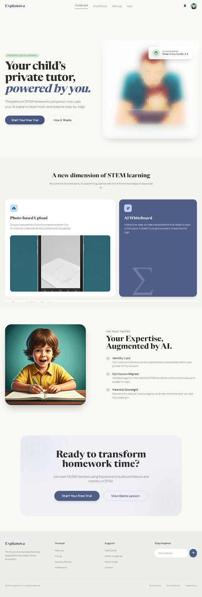 | 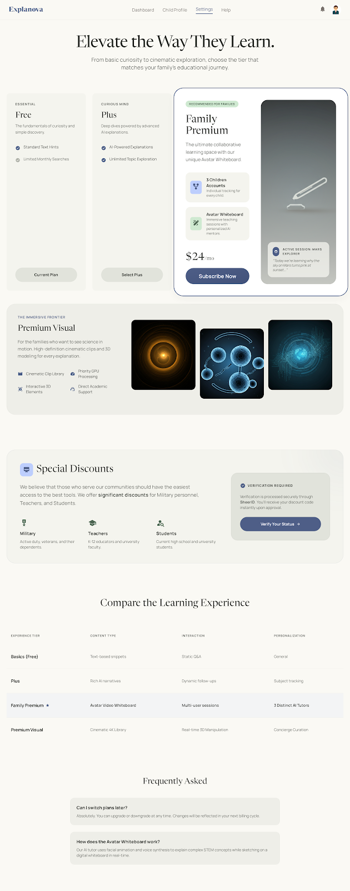 | 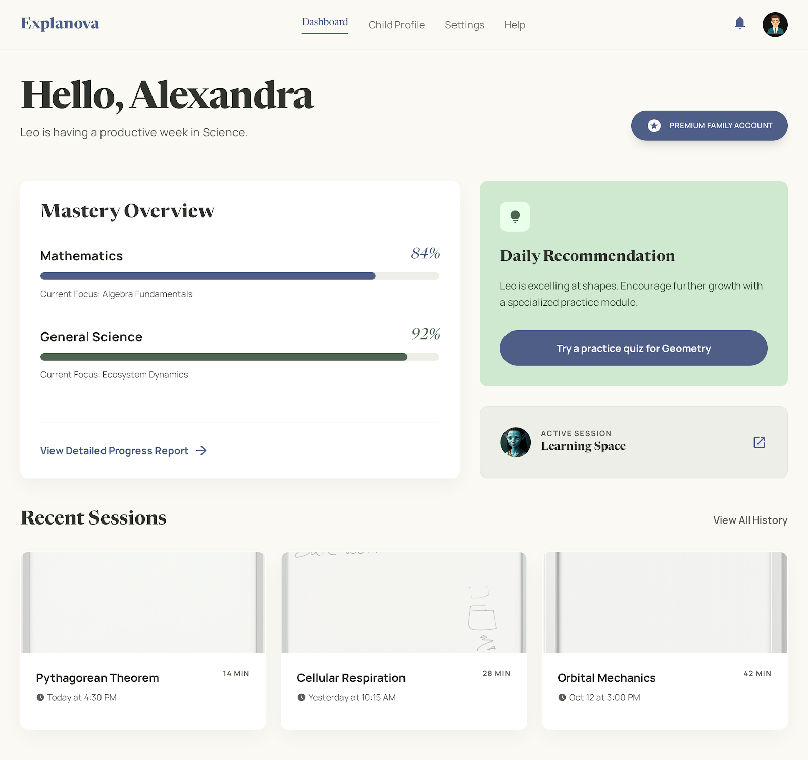 |

| Avatar setup | Avatar recording | Homework upload |
|---|---|---|
| 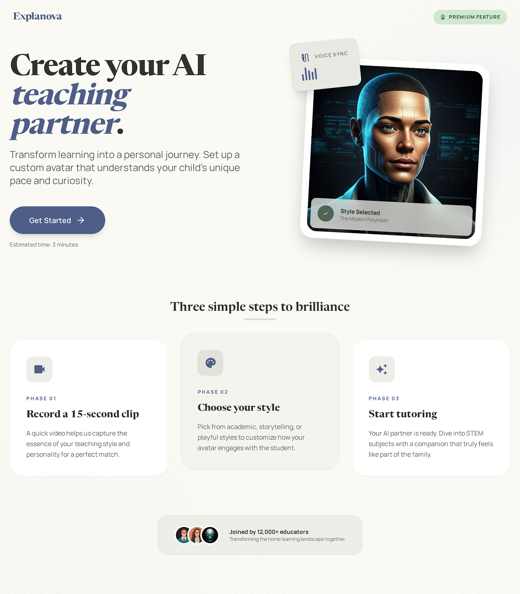 | 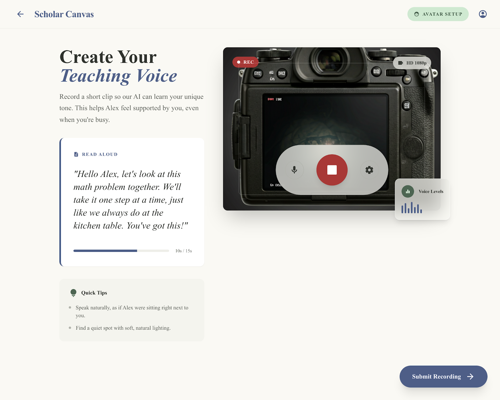 | 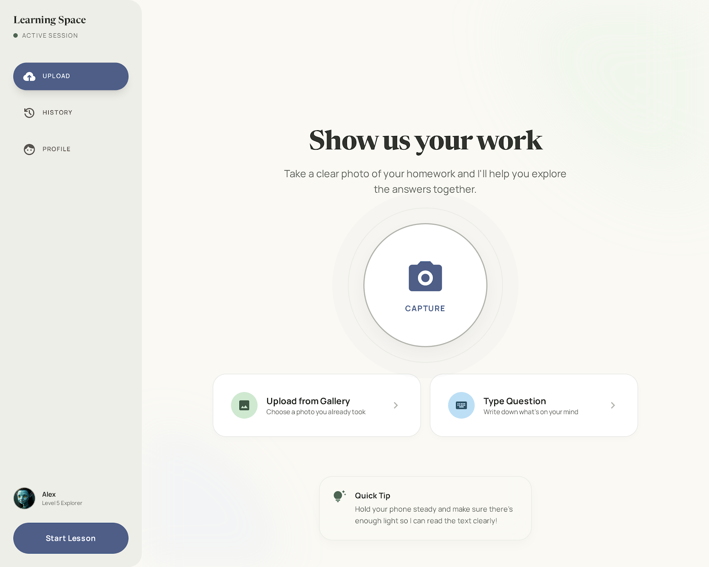 |

| Processing | Whiteboard delivery | Learning archive |
|---|---|---|
| 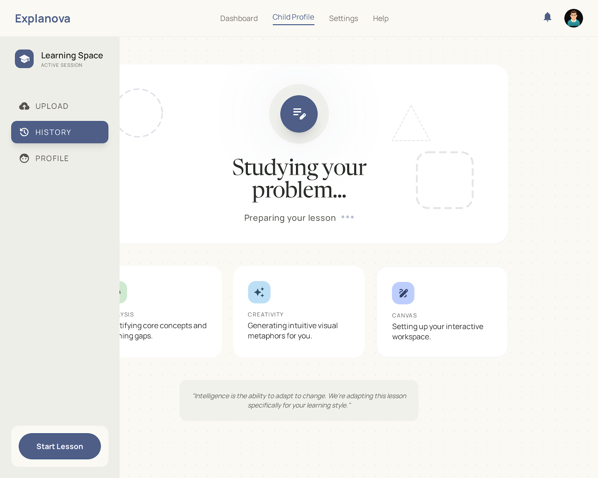 | 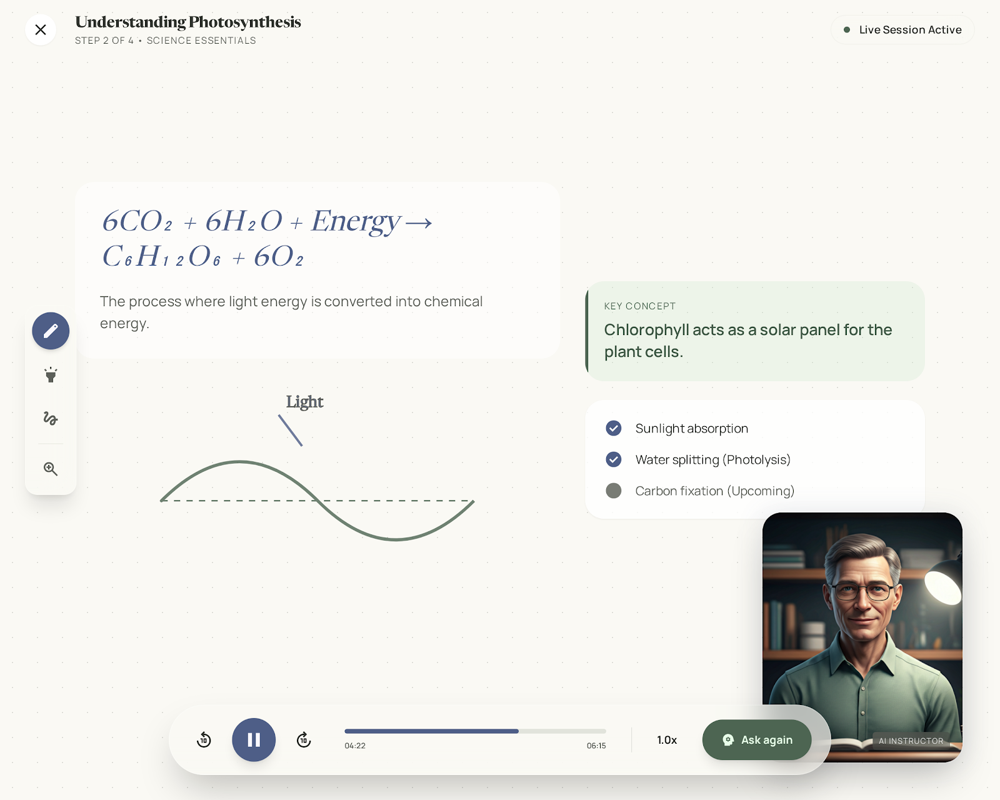 | 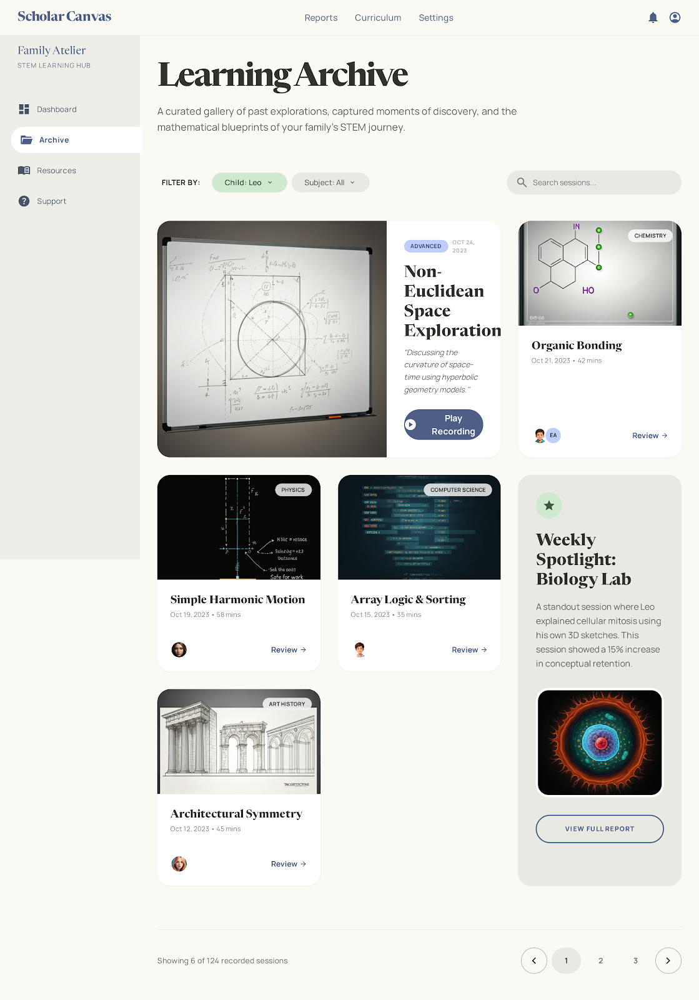 |

Why this mattered: it forced **product** decisions (subscription tiers, community pricing, child-safety consent UX) before any **engineering** decisions. By the time I opened a code editor, the product was already designed.

→ Full ideation write-up: [docs/01-ideation-stitch.md](docs/01-ideation-stitch.md)

### 3. AI prototyping in Google AI Studio

Next stop: **Google AI Studio**. I prototyped the entire AI intelligence stack — every prompt, every JSON schema, every reasoning chain — *before* writing a single line of production code. Five tasks, run sequentially on every homework question:

1. **Extraction** — image/text → normalized problem JSON
2. **Classification** — subject, topic, grade band, prerequisites, likely misconceptions
3. **Explanation (RAG-grounded)** — short answer + hint + steps + simple analogy + similar example + practice questions
4. **Practice** — 3–5 grade-appropriate variations
5. **Avatar script** — warm, parent-voice teaching script with timed whiteboard cues

Core principle: **retrieval before generation.** The model never answers from pure generation. It always retrieves from the curated concept library first, then generates a grounded response. That's what makes it trustworthy.

→ Methodology: [docs/02-ai-prototyping-studio.md](docs/02-ai-prototyping-studio.md)

### 4. From vector RAG to GraphRAG

The first production retrieval layer was vector-only: Vertex embeddings against a 10,476-entry corpus (textbook chapters, worked examples, OpenStax, MIT OCW). It worked. It also missed prerequisite gaps that pure cosine similarity can't catch — *long division* should reach for *partial quotients*, *area model*, and *estimation* even when the wording doesn't overlap.

So I migrated the retrieval layer to **GraphRAG**: a Neo4j knowledge graph with typed `COVERS` / `USES_METHOD` / `PREREQUISITE` edges across 6 grade bands × 30 quarters × 80 topics × 133 methods × 129 SOL codes (445 relationships). Queries traverse the graph, run community detection, and synthesize with the LLM. Smoke-tested end-to-end with documented `groundingQuality: "grounded"` provenance.

→ Methodology: [docs/03-graphrag-methodology.md](docs/03-graphrag-methodology.md)

### 5. Content pipeline — building the corpus

Retrieval is only as good as what's behind it. I built a content ingestion pipeline that processes textbooks, worksheets, and curated video lessons into normalized Firestore entries with embeddings, grade-band tagging, and topic classification. End state: **10,476 entries** spanning K–2 Early Learner through college, across `concept_library` and `worked_examples`.

→ Pipeline: [docs/04-content-pipeline.md](docs/04-content-pipeline.md)

### 6. Versioning + CI/CD discipline

Every shipped change is tagged, every deploy names its Cloud Run revision, and every entry in the changelog explains the *why* — not just the *what*. The full progression from `v1.0.0` to `v3.5.4` (16 tags) is the artifact of disciplined release engineering on a one-person team.

→ Release engineering: [docs/05-versioning-and-cicd.md](docs/05-versioning-and-cicd.md)

### 7. Business model — Stripe, SendGrid, tiered pricing, AI cost discipline

A lot of AI demos are technically impressive and economically broken. Explanova has Stripe billing (four-SKU tier model with scripted migrations), SendGrid email with custom-domain deliverability, community-pricing posture for military/teacher/low-income families, and a multi-model AI routing strategy that keeps cost-per-completed-lesson defensible.

→ Business + pricing + cost discipline: [docs/06-business-and-pricing.md](docs/06-business-and-pricing.md)

---

## Skill domains exercised

This product touched four distinct domains. Each has its own deep-dive:

- **🧪 Data Science** — corpus engineering, knowledge-graph design, embedding strategy, benchmark methodology → [docs/skills/data-science.md](docs/skills/data-science.md)
- **🤖 Agentic AI** — built a custom dev-support agent with **Google ADK**; orchestrated multi-model workflows (Gemini 3 Pro + 3 Flash + 2.5 Flash + Claude); plan → verify → execute supervision; structured-output discipline; retrieval-augmented agents → [docs/skills/agentic-ai.md](docs/skills/agentic-ai.md)
- **⚙️ DevOps / GCP** — Cloud Run revision pinning, Cloud Build pipelines, Cloud Secret Manager, Firebase platform, App Check + reCAPTCHA v3, Cloud TTS with ADC + rate limiting, end-to-end UX validation (78/78 Playwright tests) → [docs/skills/devops.md](docs/skills/devops.md)
- **🎯 AI Product Management** — phased roadmap, multi-provider failover policy, child-safety UX, subscription tiering, version-stamped milestone discipline → [docs/skills/ai-product-management.md](docs/skills/ai-product-management.md)

Architecture overview: [TECHNICAL.md](TECHNICAL.md)

---

## Headline metrics

<table>
<tr>
<td align="center" width="25%">

### 🚀 16
**Production releases**
v1.0.0 → v3.5.4

</td>
<td align="center" width="25%">

### 📚 10,476
**RAG corpus entries**
concept_library + worked_examples

</td>
<td align="center" width="25%">

### 🕸️ 445
**Typed graph edges**
80 topics · 133 methods · 129 SOL codes

</td>
<td align="center" width="25%">

### ✅ 78/78
**UX tests passing**
desktop + mobile Playwright

</td>
</tr>
<tr>
<td align="center">

### 🤖 4
**Production models**
Gemini 3 Pro · 3 Flash · 2.5 Flash · Claude

</td>
<td align="center">

### 🎓 K–College
**Grade-band coverage**
6 bands end-to-end

</td>
<td align="center">

### 🎬 5
**AI tasks per question**
extract → classify → explain → practice → script

</td>
<td align="center">

### 👨‍👩‍👧‍👦 6
**Account managers per family**
parents · grandparents · tutors

</td>
</tr>
</table>

### Corpus depth by grade band

```
K-2  ▓                       ~175 entries
3-5  ▓▓▓▓▓▓▓▓▓▓▓▓▓▓▓▓▓▓▓▓    ~2,100
6-8  ▓▓▓▓▓▓▓▓▓▓▓▓▓▓▓▓▓▓▓▓▓▓  ~2,400
9-10 ▓▓▓▓▓▓▓▓▓▓▓▓▓▓▓▓▓▓▓▓▓▓▓ ~2,600
11-12▓▓▓▓▓▓▓▓▓▓▓▓▓▓▓▓▓▓      ~2,000
COL  ▓▓▓▓▓▓▓▓▓▓▓             ~1,200
```

| | |
|---|---|
| **Voice synthesis** | Google Cloud TTS Neural2-F, ADC-authenticated, 4K-char rate-limited, daily quota tracked in Firestore, App Check enforced |
| **Auth providers** | Email/Password, Google, Apple |
| **Payment** | Stripe (4-SKU tier model, scripted migrations, webhook-validated) |
| **Email** | SendGrid with custom domain auth (`em1318.explanova.ai`), Cloudflare DNS, SPF/DMARC alignment verified |

---

## Author

**Stephen D. Gardner** — Founder, Explanova
U.S. Navy veteran (2002–2008) · DMV-based · parent

[explanova.ai](https://explanova.ai)
