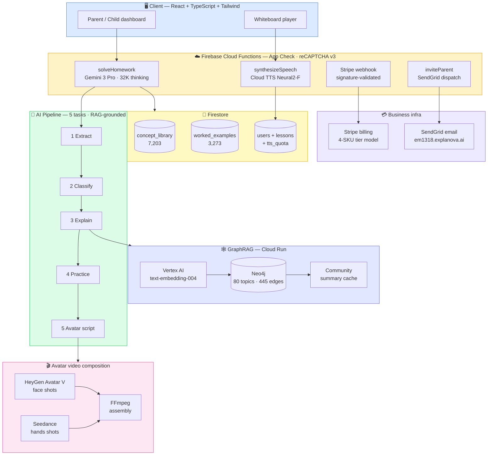

# Technical Architecture — Explanova

> Architecture overview for the live production system at [explanova.ai](https://explanova.ai).
> This document describes *what* the system does and *how* the pieces fit. Implementation code lives in a separate private repository.

---

## System architecture

---

## Frontend

- **React + TypeScript + Tailwind CSS**, Vite-built, deployed to **Firebase Hosting**
- Discriminated-union typed primitives for the whiteboard renderer (each math primitive renders deterministically — no LLM-driven HTML)
- Framer Motion for element-level entrance animations on whiteboard primitives (counters appear one by one, jump arcs trace via `pathLength`, fraction strips fill L→R)
- Authentication: Email/Password, Google, Apple
- App Check (reCAPTCHA v3) enforced on every callable function

## AI pipeline

Five tasks run in sequence on every homework question:

| Task | Input | Output |
|---|---|---|
| 1. Extraction | Photo or text | Normalized problem JSON |
| 2. Classification | Problem statement | Subject, topic, grade band, prerequisites, likely misconceptions |
| 3. Explanation (RAG-grounded) | Problem + retrieved curriculum | Step-by-step explanation, hint, simple analogy, similar example |
| 4. Practice | Concept + grade band | 3–5 practice questions with answers |
| 5. Avatar script | Explanation package | Multi-shot teaching script with timed whiteboard cues |

**Provider lineup:**

| Where | Model | Why |
|---|---|---|
| `solveHomework` (5-task pipeline) | **Gemini 3 Pro Preview** (`gemini-3-pro-preview`) at temperature 0.2 (tasks 1–4) and 0.4 (task 5), with a **32K thinking budget** | Strongest reasoning for multi-step structured output |
| Corpus ingestion | **Gemini 3 Flash Preview** (`gemini-3-flash-preview`) | Lower cost/latency for high-volume classification |
| GraphRAG community summaries | **Gemini 2.5 Flash** via AI Studio | Universally available; cached per-community for warm-call latency under 0.3s |
| Embeddings | **Vertex AI `text-embedding-004`** | Production-grade text embeddings with regional locality |
| Failover | **Claude Sonnet** | Triggered on Gemini timeout, low confidence, or out-of-curriculum classification |
| External grounding | **Perplexity** | Bounded to current-events / NASA-style queries with mandatory source citations |

**Hard constraint:** structured output via JSON schema with `anyOf` per-primitive branches. Each branch declares its own `required` fields. The model can satisfy one branch or fail validation — no silent partial outputs.

→ Methodology: [docs/02-ai-prototyping-studio.md](docs/02-ai-prototyping-studio.md)

## Retrieval — GraphRAG

Vector RAG was the v1 retrieval layer. It worked, but missed prerequisite gaps. The current production retrieval layer is a knowledge-graph-augmented RAG:

- **Graph store:** Neo4j (managed)
- **Embeddings:** Vertex AI text-embedding model
- **Edges:** `COVERS`, `USES_METHOD`, `PREREQUISITE`, grade-band ↔ quarter ↔ topic ↔ method ↔ SOL-code
- **Query path:** vector seed → graph expansion (1–2 hops) → community detection → LLM synthesis with retrieved context
- **Grounding tag:** every response carries `groundingQuality ∈ {grounded, partially_grounded, ungrounded}` with provenance

Why graph over pure vector: `long division` should reach for `partial quotients`, `area model`, and `estimation` even when the query phrasing doesn't overlap. The graph captures the curriculum's conceptual adjacency that cosine similarity misses.

→ Methodology: [docs/03-graphrag-methodology.md](docs/03-graphrag-methodology.md)

## Voice synthesis — Google Cloud TTS

The whiteboard mode narrates lesson steps via **Google Cloud Text-to-Speech** with the **Neural2-F** voice (en-US). Specifics:

- `@google-cloud/text-to-speech` SDK, **lazy-loaded inside the function handler** so the deployment container never poisons module-level cold-start if ADC permissions are misaligned
- **ADC (Application Default Credentials)** used automatically — no service-account keys in source
- **4,000-character rate limit per transaction** (Cloud TTS hard limit)
- **Daily quotas tracked in the `tts_quota` Firestore collection** so we can detect runaway usage before it becomes a billing surprise
- **App Check enforced** on the synthesizer Cloud Function (no anonymous calls)
- Used as the **interactive fallback path** when LiveAvatar fails or is disabled — students never see an error; they transition seamlessly into Whiteboard mode with synchronized TTS narration per step

## Agentic AI orchestration

The 5-task pipeline isn't five LLM calls — it's a supervised agent loop:

- **Plan** — model emits a structured plan with primitive selection and expected schema branch
- **Verify** — schema validation (`anyOf` per primitive) + grounding-quality check against retrieved context
- **Execute** — only on a verified plan; failures surface as typed errors, never as malformed UI

A separate **custom dev-support agent built with Google ADK (Agent Development Kit)** handled task triage, code review delegation, and review/test coordination during the build itself — investing in the build process the way a senior engineer invests in better CI tooling.

→ Methodology: [docs/skills/agentic-ai.md](docs/skills/agentic-ai.md)

## Avatar video composition

The parent's avatar is composed from multiple specialized providers and assembled per lesson:

- **Face shots** (`face_front`, `face_side`, `face_close`): HeyGen Avatar V (identity stability + motion DNA)
- **Hands shots** (`hands_whiteboard`): Seedance 2.0 via BytePlus API
- **Assembly:** FFmpeg concatenates shots in script order
- **Provider abstraction:** `VideoGenerationProvider` interface with `BytePlusAdapter`, `FalAiAdapter`, and `MockAdapter` implementations. Provider can be swapped without touching the orchestration layer.

## Data model

| Collection | Purpose |
|---|---|
| `concept_library` | Ingested textbook chapters, video lesson concepts, reference material (with embeddings) |
| `worked_examples` | Worksheets, problem sets, step-by-step solutions (with embeddings) |
| `users/{uid}` | Parent profiles, child profiles, session history |
| `lessons` | Completed lesson sessions |
| `practice_sessions` | Practice question sessions |

**Security:** Users own their profiles and child profiles. Lessons are readable by the owning parent only. `concept_library` and `worked_examples` are read-only for authenticated users (writes via Cloud Functions only).

→ Content pipeline: [docs/04-content-pipeline.md](docs/04-content-pipeline.md)

## DevOps

- **Hosting + Functions:** Firebase Hosting + Firebase Functions (Blaze plan)
- **GraphRAG service:** Cloud Run, region `us-central1`, container built via Cloud Build
- **Revision discipline:** every deploy names its revision. Crash-loop revisions are documented in the changelog rather than hidden.
- **CI:** Cloud Build per service; Playwright UX validation suite (78 tests across desktop + mobile viewports) gates risky frontend changes
- **Secrets:** `defineSecret` bindings on every callable; no env var leakage
- **Observability:** structured logs + frontend `auditDiagramData()` telemetry for any malformed AI payload

→ Release engineering: [docs/05-versioning-and-cicd.md](docs/05-versioning-and-cicd.md)

## Skill-domain deep-dives

- 🧪 [Data Science](docs/skills/data-science.md)
- ⚙️ [DevOps](docs/skills/devops.md)
- 🎯 [AI Product Management](docs/skills/ai-product-management.md)

---

**Author:** Stephen D. Gardner — [explanova.ai](https://explanova.ai)
