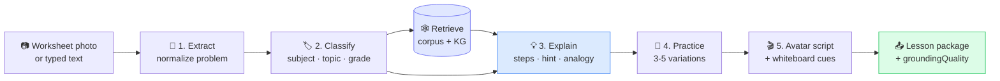

# 02 — AI Prototyping in Google AI Studio

> The methodology behind Explanova's five-task AI pipeline — built in **Google AI Studio** before any production code, with retrieval-first as the non-negotiable principle.

← [Back to README](../README.md)

---

## Core principle — retrieval before generation

The single most important architectural decision: **the AI never answers from pure generation alone.**

Every homework question goes through a retrieval step against the curated concept library and worked-examples corpus *before* the LLM is asked to produce an explanation. The model is grounded in actual K–12 curriculum sources rather than its own pretraining priors.

That's what makes the product trustworthy enough for a parent to put in front of their child.

## The five-task pipeline

I prototyped each of these in AI Studio with real worksheets from my Math folder, iterated on the system prompt until the JSON output was deterministic, then promoted them to production. All five run in sequence on every homework question.

### Task 1 — Extraction
- **Input:** Worksheet photo or typed math/science question
- **Output:** Normalized problem JSON with extraction confidence
- **Methodology:** OCR + notation normalization (`+ - × ÷ =`, fractions as `a/b`); multi-problem images handled per-problem; extraction never solves — it only extracts; uncertainty is flagged, not hidden

### Task 2 — Classification
- **Input:** Extracted problem statement
- **Output:** Subject, topic, subtopic, grade band, prerequisites, likely misconceptions, difficulty
- **Methodology:** Constrained subject taxonomy (15 categories: Basic Math through Calculus 3, Statistics, Chemistry, Physics 1–3); seven grade bands; misconceptions enumerated explicitly so the explanation task can pre-empt them

### Task 3 — Explanation (RAG-grounded)
- **Input:** Problem + classification + retrieved concept library context + retrieved worked examples
- **Output:** Short answer · hint · ordered steps · simple analogy · similar example · practice questions · grounding quality tag
- **Methodology:**
  - Language complexity adapts to grade band (K–2 / 6–8 / 9+ each have explicit voice rules)
  - Hint gives direction without revealing the answer
  - Steps are detailed enough that a student could follow independently
  - Simple explanation uses an analogy or everyday comparison (the kitchen-table-parent voice)
  - Similar example varies the numbers but tests the same concept
  - **`grounding_quality ∈ {strong, partial, ungrounded}`** — every response carries provenance

### Task 4 — Practice
- **Input:** Concept + grade band + difficulty
- **Output:** 3–5 practice questions with answers, brief solutions, and hints
- **Methodology:** Difficulty stair-steps (easy → medium → harder); never repeats the exact problem just asked; vocabulary scales with grade band

### Task 5 — Avatar Script
- **Input:** The full explanation package
- **Output:** Teaching script (30–90 seconds spoken) + timed whiteboard cues
- **Methodology:**
  - Warm opener ("Let's work through this together")
  - Conversational tone — contractions, short sentences, parent-to-child voice
  - **Whiteboard cues in `[brackets]`** for the deterministic renderer (not free-form HTML)
  - Encouraging close
  - Vocabulary matched to grade band

## Schema discipline — `anyOf` per primitive

Early production runs surfaced a class of bug: when every primitive field was declared as an optional sibling in a flat schema, Gemini would satisfy the schema by emitting just `{"type": "ten_frame"}` and skip the quantity fields. Result: empty whiteboards on K-2 problems.

Fix: **schema-level enforcement.** The `diagram_data` schema is now an `anyOf` with one branch per primitive type. Each branch declares its own `required` array (e.g. `ten_frame` requires `filled` and `total`; `number_line` requires `min`, `max`, and `points`). The model must populate the required fields or fail validation.

That's the kind of failure mode you only catch in production — and only fix at the *schema* layer, not by re-prompting.

## Benchmark methodology

Before any prompt was promoted to production, it was scored against a held-out benchmark set:

| Criterion | Weight |
|---|---|
| Correctness | 40% |
| Classification accuracy | 15% |
| Explanation quality (clarity, completeness, grade-appropriateness) | 20% |
| Grounding quality (effective use of retrieved context) | 15% |
| Hint quality (guides without revealing) | 10% |

Success thresholds: ≥95% overall correctness, ≥90% classification accuracy, ≥85% strong-or-partial grounding, **zero incorrect answers presented with high confidence.**

I also ran the benchmark twice — **with retrieval context** vs. **without** — to quantify the lift from the curated corpus. That delta is the dollar value of the content library.

## Provider failover policy

Three provider lanes, each with a defined trigger:

- **Gemini 3 (primary)** — temperature 0.2 for tasks 1–4, 0.4 for task 5
- **Claude Sonnet (failover)** — triggered on Gemini timeout, low confidence, or out-of-curriculum classification
- **Perplexity (external grounding)** — bounded to current-events / NASA-style queries that require fresh sources, with mandatory citation

This is methodology, not a single point of failure.

→ Next: [03 — GraphRAG methodology](03-graphrag-methodology.md)
