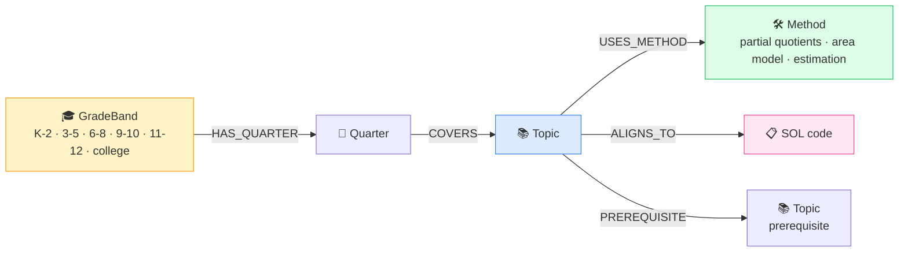
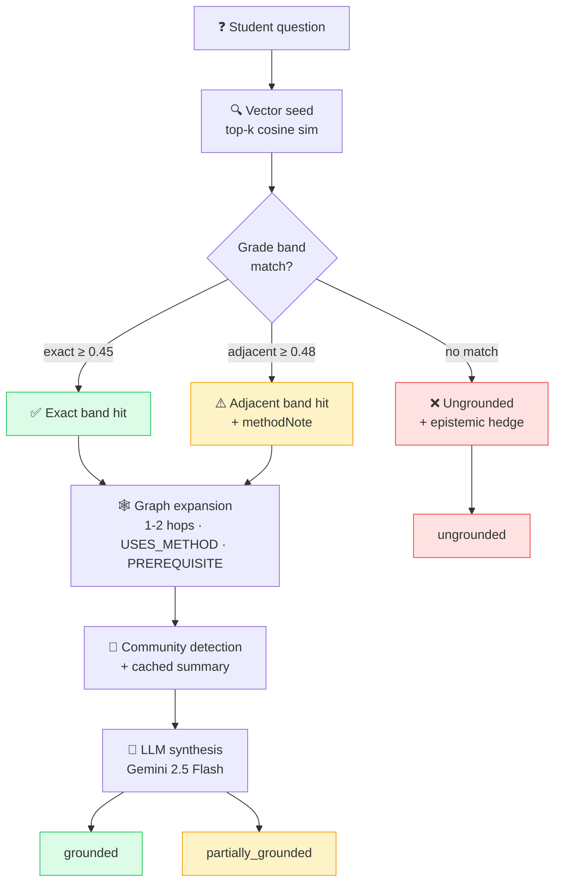

# 03 — GraphRAG Methodology

> Why Explanova moved from vector-only RAG to a knowledge-graph-augmented retrieval layer, and what the graph looks like.

← [Back to README](../README.md)

---

## The problem with pure vector RAG

Vector RAG was Explanova's v1 retrieval layer. Worksheet gets embedded, cosine-similar chunks come back, LLM synthesizes. It worked.

It also **missed prerequisite gaps**.

A concrete example: a student types *"What is 384 divided by 12?"* The curriculum teaches long division through three methods a K–5 teacher would actually reach for — **partial quotients**, the **area model**, and **estimation-based division**. A pure vector search on the phrase "384 divided by 12" returns chunks about long division — but it doesn't always surface the *method diversity* that makes an explanation age-appropriate. The embeddings don't natively encode that "area model" and "partial quotients" are sibling methods under the same topic.

That's a curriculum-adjacency problem, not a similarity problem.

## The graph structure

Current populated graph:

| Node type | Count |
|---|---|
| Grade bands | 6 |
| Quarters | 30 |
| Topics | 80 |
| Methods | 133 |
| SOL codes | 129 |
| **Typed relationships** | **445** |

The graph was ingested from a curated curriculum source plus supplemental material from the concept library, with typed edges laid down explicitly rather than inferred.

## The query path — visual

## The query path

Every incoming question goes through the same five-step retrieval pipeline:

1. **Vector seed** — embed the question, retrieve top-k candidate topics by cosine similarity
2. **Grade-band filter + adjacent-band fallback** — try the student's exact grade band first; if no topic passes the confidence threshold, fall back to adjacent bands (`K–2 ↔ 3–5 ↔ 6–8 ↔ 9–10 ↔ 11–12 ↔ college`) with a *stricter* threshold, and mark the result as `partially_grounded` with a methodNote so the avatar can frame age-appropriately
3. **Graph expansion** — from the seed topic, traverse 1–2 hops along `USES_METHOD`, `PREREQUISITE`, and `ALIGNS_TO` edges
4. **Community detection** — identify the tight curriculum community around the seed and pull a cached per-community summary
5. **LLM synthesis** — pass the assembled context (topic + methods + SOL alignments + community summary) to the explanation task

## Grounding provenance — every response carries a tag

The retrieval layer returns one of three grounding states, and every downstream response surfaces it:

- **`grounded`** — exact-band hit, strong corpus coverage; avatar teaches confidently
- **`partially_grounded`** — adjacent-band hit or partial corpus coverage; avatar teaches with a brief framing caveat ("this is typically taught in 3–5; I'll explain it in a K–2-friendly way")
- **`ungrounded`** — no confident match; avatar falls back to pure generation with an explicit epistemic hedge, *and the frontend surfaces that to the parent*

No grounded-looking answer ever ships from an ungrounded retrieval.

## Why this is better than pure vector

- **Catches method diversity.** A "long division" query surfaces partial quotients + area model + estimation as sibling methods — the three a real teacher would show — not just the single highest-similarity chunk.
- **Respects grade-band boundaries.** A K–2 question that accidentally matches a 6–8 chunk gets demoted to `partially_grounded` with a caveat rather than silently taught at the wrong level.
- **Explains prerequisite gaps.** Graph edges let the explanation surface the *why* behind a missing prerequisite, not just the topic itself.

## Caching + performance

Community summaries are deterministic given community membership, and membership only changes on graph rebuild — so they're cached per-topic. Cold call on a fresh community runs ~10s (LLM summarization under the hood); warm cached call drops to ~0.25s. Cache invalidation is tied to graph refresh, so there's no staleness risk.

Frontend timeouts were tuned to accommodate the first cold community call: early production had an 8s client timeout that threw on warm-up and silently fell back to vector search. Raised to 25s after live log analysis surfaced the pattern. Small discipline; large correctness impact.

→ Next: [04 — Content pipeline](04-content-pipeline.md)
