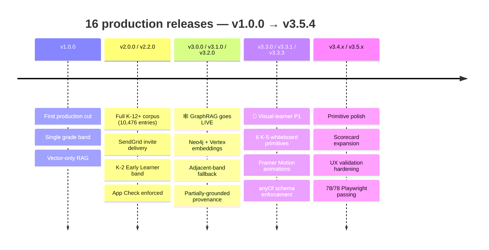

# 05 — Versioning and CI/CD

> 16 semver releases. Every deploy names its Cloud Run revision. Every changelog entry explains the *why*. What disciplined release engineering looks like on a one-person team.

← [Back to README](../README.md)

---

## The release arc — v1.0.0 → v3.5.4

Sixteen tagged releases across the life of the project to date. The arc:

| Era | Versions | What shipped |
|---|---|---|
| **v1.x** | `v1.0.0` | First production cut — single grade band, vector-only RAG, basic whiteboard |
| **v2.x** | `v2.0.0`, `v2.2.0` | Full K–12+ RAG corpus complete (10,476 entries), invite email delivery, K–2 Early Learner band added end-to-end, up to 6 account managers per family, App Check enforced |
| **v3.0.x** | `v3.0.0`, `v3.1.0`, `v3.2.0` | **GraphRAG goes live** — Neo4j + Vertex embeddings + community detection on Cloud Run; community-summary LLM wired end-to-end; adjacent-band fallback classifier with partially-grounded provenance |
| **v3.3.x** | `v3.3.0`, `v3.3.1`, `v3.3.3` | P1 of the visual-learner initiative — six K–5 whiteboard primitives (ten_frame, number_line, counter_grid, fraction_strip, area_model, tape_diagram) with framer-motion entrance animations; schema `anyOf` enforcement to eliminate empty-primitive bugs |
| **v3.4.x** | `v3.4.0`, `v3.4.1`, `v3.4.2` | Primitive-level polish + expanded scorecard coverage |
| **v3.5.x** | `v3.5.0` → `v3.5.4` | Additional primitive refinements + UX validation hardening |

Every tag maps to a dated changelog entry that names the file + line of the fix, the Cloud Run revision that shipped it, and the *why*.

## Release engineering — the rules I hold myself to

### 1. Semver discipline

- **Major** (v1 → v2, v2 → v3) — structural change to retrieval or data model. *v3.0.0* was the vector-RAG → GraphRAG migration.
- **Minor** (v3.3.0 → v3.4.0) — new product capability that a user would notice.
- **Patch** (v3.3.1 → v3.3.3) — bugfix or hardening of an already-shipped capability. Follows the just-shipped feature in time and motivation.

### 2. Revision pinning in the changelog

Every deploy names its Cloud Run revision. Example phrasing straight from the changelog:

> *"Cloud Run revisions: `00025-lq5` (initial, threshold 0.55) → `00026-pd8` (threshold 0.50) → `00027-cqx` (threshold 0.48, live). Firebase Functions: `solveHomework` updated alongside 24 other functions in a single deploy (App Check + secret bindings preserved)."*

This gives me:
- Deterministic rollback target
- Audit trail for threshold tuning
- A record of "what was live on what date" that doesn't depend on Cloud Console retention

### 3. Document crash-loops, don't hide them

A few Cloud Run revisions in this project's life crash-looped on import errors before stabilizing. Those failures are **documented** in the changelog — including the root cause (missing `tenacity` import on a `@retry` decorator), the stale-pin issue that blocked Cloud Build on first attempt, and the revision range that was broken (`00001-00003`) vs. the one that stabilized (`00004-gl2`).

Hiding failures is how you lose the ability to learn from them. Documenting them is how a solo engineer builds the same operational maturity a team would have from post-mortems.

### 4. Frontend telemetry ships *with* the schema fix

The schema-level enforcement fix for empty primitives landed alongside a frontend `auditDiagramData()` function that checks every incoming primitive against a per-type required-fields map and logs a `console.warn` with the full payload when a field is missing. Defense in depth: the schema can't be bypassed, and if a future change somehow reintroduces the class of bug, the telemetry catches it.

### 5. Branch strategy

- Feature branches: `feat/t{task-id}-{slug}` (e.g. `feat/t093-visual-primitives`)
- Merge to **both** `master` and `main` (this project's dual-branch publish policy), tag the release, deploy
- Changelog entry written alongside the merge, not after

### 6. Tests gate the risky stuff

The Playwright UX validation suite (78 tests across desktop + mobile viewports) gates any change that touches the whiteboard primitives. Snapshots catch visual regression that unit tests miss.

## What this gives me

Running Explanova solo, the changelog + tag history is my external brain. Every decision is re-findable. Every live revision is traceable. Every rollback has a named target. No shipped change is ever a surprise six months later.

That's the discipline the next engineer on this codebase — or the next hiring manager reading this — should be able to see at a glance.

→ Next: [06 — Business + pricing](06-business-and-pricing.md)
