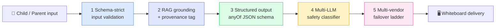

# 07 — Trust & Safety as Product Architecture

> How Explanova treats safety, grounding, and provider-resilience as first-class
> product features — not afterthoughts.

← [Back to README](../README.md)

---

## Why this chapter exists

A generative-AI tutor for children is a high-stakes deployment. Wrong answers mistaught at a kitchen table compound into wrong intuitions. Hallucinated sources mistaught to a 4th-grader undermine years of teacher work. Unsafe third-party content recommended without screening crosses a parental-trust line that cannot be re-earned.

Explanova was architected with these failure modes assumed, not avoided. Every output the system delivers to a child travels through a multi-tier defense pipeline before it reaches the whiteboard.

This chapter walks the architecture of that pipeline. It is intentionally the most provider-agnostic chapter in this repository — the patterns work whether the reasoning model is Gemini, Claude, GPT, or whatever ships next.

> **Build-time vs runtime — a note on provider use**
>
> Explanova's *runtime* stack is multi-vendor with Gemini 3 Pro as the primary reasoning model. Explanova's *build-time* stack is [Claude Code](https://www.anthropic.com/claude-code) on macOS as the primary development partner — every architectural decision in this chapter, every schema branch in the guard cycles, and every fail-safe ladder in the safety pipeline was reasoned through with Claude as the architect-in-the-loop before it was committed to production. The patterns described below were not designed in isolation and then implemented; they were co-designed.

---

## The five defense tiers (overview)



Every tier can independently fail-safe. The system is engineered so that a provider outage, a model regression, or a schema-drift incident degrades gracefully rather than catastrophically.

---

## Tier 1 — Schema-strict input validation

Every callable function is protected by **Firebase App Check + reCAPTCHA v3** before the request reaches the AI pipeline. This is bot defense and parent-account-binding enforcement — every request is signed, scored, and attributable to a parent-verified Firebase identity.

Beyond auth, every payload is validated against a typed schema. Homework images get MIME-sniffed and size-bounded. Free-text problem statements get length-bounded and Unicode-normalized. Nothing reaches the model without passing the perimeter.

---

## Tier 2 — Grounding-first retrieval with provenance tags

The single most important safety primitive in Explanova: **every response carries a grounding tag and provenance trail.**

```
groundingQuality ∈ { grounded | partially_grounded | ungrounded }
provenance       = { topic_id, method_ids[], sol_codes[], community_summary_id }
```

- **`grounded`** — exact grade-band hit, strong corpus coverage, full provenance chain. The avatar teaches normally.
- **`partially_grounded`** — adjacent grade-band fallback under stricter threshold. The avatar attaches a `methodNote` so the teaching is framed age-appropriately ("This is a method you'll see more of next year, but here's how it works at your level").
- **`ungrounded`** — no confident retrieval. The avatar surfaces an epistemic hedge instead of generating freely. We would rather a child hears "I'm not certain about this — let's check together" than hears a confident hallucination.

This is the line Explanova will not cross: **no ungrounded answer is ever delivered as if it were grounded.** Provenance is not a debug field; it is a product feature visible to the parent in the lesson archive.

---

## Tier 3 — Schema-strict structured output

The 5-task pipeline (see [docs/02-ai-prototyping-studio.md](02-ai-prototyping-studio.md)) outputs structured JSON validated against a discriminated-union schema. Each whiteboard primitive (`number_line`, `area_model`, `counter_grid`, `bar_chart`, `vector_arrow`, `venn_diagram`, `box_plot`, `circuit`, `labeled_image`, etc.) declares its own `required` fields under an `anyOf` branch.

The model can satisfy exactly one branch or fail validation. There is no "silently render whatever the LLM happened to emit" path.

When a branch validation fails, the system invokes a per-primitive **structural guard** with a recovery validator that either remaps fields into a valid shape (when safe) or rejects the output and re-prompts with narrower constraints. Six guard cycles have been hardened in production (`bar_chart`, `vector_arrow`, `venn_diagram`, `box_plot`, `labeled_image`, `circuit`), each with structural anti-pattern detection plus a schema-bleed diagnostic to prevent silent cross-primitive contamination.

This is the Anthropic-style tool-use discipline: **the model's output is the model's hypothesis. The schema is the contract. The validator is the arbiter.**

---

## Tier 4 — Multi-LLM safety classifier for third-party content

When Explanova recommends supplementary YouTube content to extend a homework lesson, every candidate video first passes through an **agentic LLM safety vet pipeline** before surfacing to the child:

1. **SafeSearch strict** — provider-side default filter (YouTube API)
2. **Per-video LLM safety classifier** — independent reasoning pass (currently Gemini 2.5 Flash; **architecturally provider-agnostic and could swap to Claude for organizations preferring Anthropic alignment**)
3. **Fail-safe ladder** — if the safety pass times out, errors, or returns ambiguous, the video is dropped from the recommendation set, not surfaced with a "probably-safe" caveat
4. **24-hour Firestore cache + quota fallback** — safety verdicts are cached to absorb provider quota limits without degrading safety posture

The classifier prompt is versioned and cached at v2. Token budget was deliberately bumped during hardening so the classifier has room to reason rather than pattern-match. Per-organization swap from Gemini to Claude is a config flip, not a code change.

---

## Tier 5 — Multi-vendor failover ladder

Explanova is **provider-agnostic by design**, not provider-loyal.

| Layer | Primary | Failover triggers | Failover provider |
|---|---|---|---|
| Reasoning (5-task pipeline) | Gemini 3 Pro Preview (32K thinking) | Timeout, low-confidence, out-of-curriculum classification | **Claude Sonnet (Anthropic)** |
| Safety classifier | Gemini 2.5 Flash | Timeout, ambiguous verdict | **Drop-safe + Claude alternate path** |
| External grounding | Perplexity | Source unavailable | Vertex AI grounded search |
| Embeddings | Vertex AI `text-embedding-004` | Service degradation | Cached embeddings + queue |
| TTS | Cloud TTS Neural2-F | Quota or auth issue | Cached audio + retry |

**Why this matters for an AI Solutions Architect reading this:**

A production deployment that hard-locks to a single LLM provider is a production deployment with a single point of failure. Explanova treats Claude as a deliberate part of its safety-relevant resilience strategy, not as a "what if Gemini breaks" hack. The failover triggers are explicit, the routing is deterministic, and the model selection is observable per request.

For an organization standardizing on Claude as primary, the same architecture flips cleanly: Claude becomes the primary, Gemini becomes the failover, and the safety classifier moves to a Claude-native prompt. The architecture does not change — the configuration does.

---

## Observability — kid-safety BigQuery dashboard

Every safety decision the system makes is logged to BigQuery with full context (parent_id, child_age_band, candidate_content_id, classifier verdict, latency, cache hit/miss, fail-safe path triggered). The dashboard exposes three alert tiers:

- **Tier 1 (info)** — daily classifier verdict distribution drift
- **Tier 2 (warn)** — sustained drop-rate above baseline for a content source (signals upstream content quality regression)
- **Tier 3 (page)** — any single child-facing delivery where the safety pipeline returned a verdict that disagreed with cached-prior classifications for the same content (signals model drift or potential jailbreak attempt)

Sample dumps are exported weekly for parent-cohort manual review. Nothing in the safety pipeline is observed only through aggregate metrics.

---

## Disaster recovery — every failure mode has a documented contingency

Every safety-relevant integration carries an explicit rollback contingency:

- **YouTube API quota denial** — documented rollback path that disables video recommendations entirely rather than degrading safety posture, with user-facing messaging and parent notification scripted in advance
- **Safety classifier provider outage** — drop-safe (no recommendation) rather than fail-open (recommendation without verdict)
- **Grounding retrieval degradation** — surface `partially_grounded` or `ungrounded` to the avatar; the avatar's script changes accordingly
- **Schema validation cascade failure** — block the response, re-prompt with narrower constraints, escalate to a parent-visible "we couldn't generate this lesson — try a different problem" message rather than ship a malformed whiteboard

These contingencies are not theoretical. Every one has been exercised at least once in production and the runbook updated based on what happened.

---

## What this architecture means for an AI Solutions Architect

A Solutions Architect deploying frontier-AI capability for a regulated customer — government, healthcare, K–12, finance — is hired to translate a model into a production system that survives audit, incident, and provider drift.

The patterns in this chapter are battle-tested in production at Explanova for one customer profile (parents of K–12 students). The same patterns generalize cleanly to other regulated deployments:

- **Provenance-first retrieval** with grounding tags works equally well for legal research, clinical decision support, and intelligence analysis
- **Schema-strict structured output** with primitive-level guards generalizes to any domain where the model's output drives a UI or downstream action
- **Multi-LLM safety classifier** as an independent reasoning pass generalizes to any deployment where content is gated by policy
- **Multi-vendor failover by design** generalizes to any deployment where single-provider lock-in is an unacceptable concentration risk
- **Tiered observability + documented rollback** generalizes to any deployment where audit and incident response are first-class concerns

The technology choices are situational. The architectural discipline transfers.

A final note for an SA reading this: the architecture in this chapter exists in production because **Claude Code was the build-time reasoning partner** that made it tractable for a solo founder to ship and harden it. The same loop — Claude-as-architect, ship, observe, harden — is the loop a Solutions Architect runs *with their customer's engineering team* on Claude API deployments. The build experience is the deployment experience, scaled.

---

## Related chapters

- [TECHNICAL.md](../TECHNICAL.md) — system architecture overview
- [docs/02-ai-prototyping-studio.md](02-ai-prototyping-studio.md) — the 5-task AI pipeline
- [docs/03-graphrag-methodology.md](03-graphrag-methodology.md) — the retrieval foundation that produces grounding tags
- [docs/04-content-pipeline.md](04-content-pipeline.md) — corpus build that anchors the grounding system

---

← [Back to README](../README.md)
