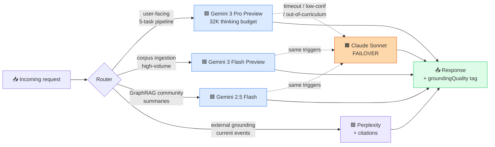

# 🤖 Agentic AI — Skills Exercised

← [Back to README](../../README.md)

---

Building Explanova solo, in production, with retrieval-grounded outputs at every layer of the pipeline, was as much an **agentic-AI engineering** exercise as it was a SaaS build. Here's the skill surface I exercised.

## Multi-model routing — visual

## Multi-model orchestration

The production AI pipeline isn't one LLM. It's four, each picked for what it's best at, with explicit triage rules:

| Model | Where it runs | Why this model |
|---|---|---|
| **Gemini 3 Pro Preview** (`gemini-3-pro-preview`) | `solveHomework` — the user-facing 5-task pipeline | Strongest reasoning for grade-band-aware explanation generation; supports a 32K thinking budget for the multi-step structured output |
| **Gemini 3 Flash Preview** (`gemini-3-flash-preview`) | Corpus ingestion (concept_library + worked_examples chunk classification) | Lower latency and cost for high-volume, lower-complexity classification work |
| **Gemini 2.5 Flash** (`gemini-2.5-flash`) | GraphRAG community-summary LLM on Cloud Run | Universally available on AI Studio (after Vertex AI Generative Models 404'd on the project), small enough to keep summary latency tolerable |
| **Claude Sonnet** | Failover lane | Triggered on Gemini timeout, low confidence, or out-of-curriculum classification |

Multi-model is not "I tried a few." Multi-model is **a documented decision per call site, with a documented fallback.** Routing between providers is part of the product, not an afterthought.

## Structured-output discipline

Agentic systems break when the model's output drifts from the expected shape. Three layers of defense in this product:

1. **JSON-schema enforcement at the API layer** — `responseSchema` with `anyOf` per primitive type. Each branch declares its own `required` array. The model must satisfy one branch or fail validation; no silent partial output.
2. **Frontend audit telemetry** — `auditDiagramData()` logs a `console.warn` with the full payload when any required field is missing, even if the schema somehow accepts it. Defense in depth.
3. **Per-task temperature pinning** — 0.2 for tasks 1–4 (deterministic), 0.4 for the avatar-script task (allows warmth). Temperature isn't a knob you guess; it's a product decision per task.

## Retrieval-augmented agents

Every model call that produces user-facing content runs *after* a retrieval step:

- Vector seed against the 10,476-entry corpus
- Graph expansion across the curriculum knowledge graph (80 topics × 133 methods × 445 typed edges)
- Community detection
- Cached per-community summaries (cold ~10s LLM call → warm 0.25s, ~40× speedup)

The model is grounded by construction. **No grounded-looking answer ever ships from an ungrounded retrieval** — the grounding tag (`grounded` / `partially_grounded` / `ungrounded`) is propagated all the way to the parent UI.

## Plan → verify → execute supervision

Long-running structured tasks (e.g. multi-step explanation packages with 14-branch schemas) are run under explicit supervision:

- **Plan** — the model emits a structured plan first (steps, primitive selection, expected schema branch)
- **Verify** — schema validation + grounding-quality check against the retrieved context
- **Execute** — only on a verified plan; failures surface as typed errors, not malformed UI

This is the supervision loop that keeps agent output deterministic enough to put in front of a child.

## Building tools to support the build itself

I also used **Google ADK (Agent Development Kit)** to build a custom development-support agent that handled task triage, code review delegation, and review/test coordination during the Explanova build. That meta-agent isn't part of the production product surface — it's an infrastructure investment in *the build process*, the same way a senior engineer might invest in better CI tooling.

ADK is the right choice when you want a real agent with tool-calling, state, and multi-step planning — not a thin LLM wrapper. Building one taught me the operational realities of agent supervision (cost control, prompt drift, rollback) that no amount of demo-watching would.

## Long-context discipline + thinking budgets

Gemini 3 Pro Preview supports an explicit thinking budget. I run it at 32K to give the model enough room for multi-step structured output across 14 schema branches. That isn't a default — it's a calibrated decision based on observed cost-per-call vs. quality-per-call.

A related discipline: client-side timeouts were tuned to the actual cold-start latency of the underlying retrieval (raised from 8s to 25s on the Cloud Run hop after live log analysis surfaced the pattern). Agent latency budgets have to match real downstream latency, not aspirational latency.

## Failure-mode literacy

Agentic AI systems fail in specific ways. I have first-hand experience with each:

- **Self-labeling drift** — Gemini 3 Pro Preview was self-labeling its JSON output `"ungrounded"` even when GraphRAG context was clearly being used (Internal Reasoning explicitly cited "as mandated by the pedagogical guidelines"). Caught and corrected via prompt rework + explicit grounding-tag pass-through.
- **Optional-field stripping** — flat optional-sibling schemas → empty primitives. Fixed at the schema layer with `anyOf` branches.
- **Provider 404 on enabled-but-not-truly-available models** — Vertex AI Generative Models returned 404 on three model IDs that *appeared* available. Documented the fallback path to AI Studio API key + Gemini 2.5 Flash.

You don't earn agentic-AI literacy from reading. You earn it from shipping, watching the logs, and writing down what broke.

## What this rolls up to

Multi-model orchestration + structured-output discipline + retrieval-augmented agents + plan/verify/execute supervision + tooling-for-the-build (Google ADK) + long-context calibration + failure-mode literacy. That's the full agentic-AI engineering loop, exercised in a live production system.

→ Next skill: [⚙️ DevOps](devops.md)
